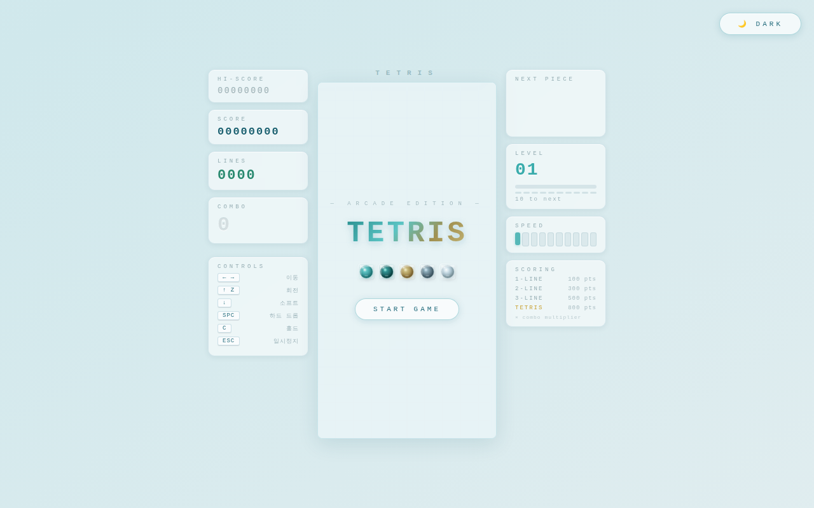
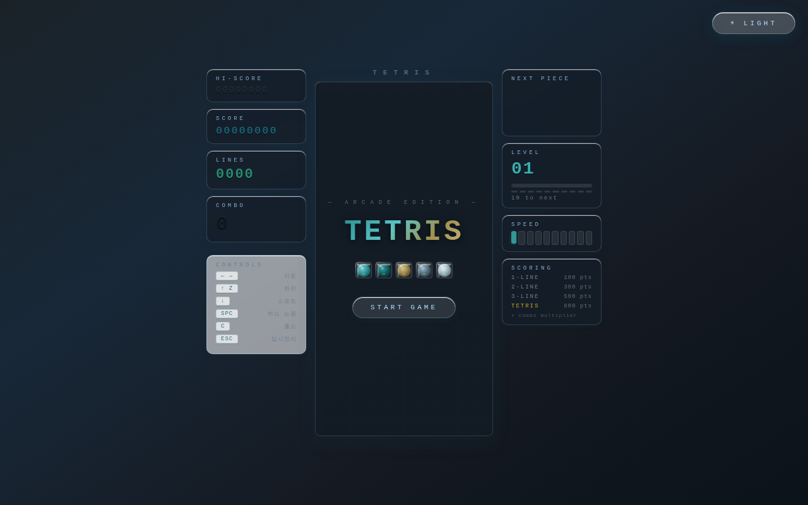

# 🧊 Glass Tetris Arcade (Arcade Edition) 🎮

[](https://react.dev/)
[](https://vitejs.dev/)
[](LICENSE)

**Glass Tetris Arcade**는 현대적인 **Glassmorphism(유리 질감)** 디자인 언어를 테트리스라는 고전적인 게임에 결합한 실험적인 프로젝트입니다. 정교한 SVG 렌더링 기술과 반응형 인터페이스를 통해 PC와 모바일 모두에서 몰입감 넘치는 아케이드 경험을 제공합니다.

---

## ✨ 핵심 기능 (Key Features)

### 🎨 시각적 경험
- **Glassmorphism UI**: 투명도, 블러(Backdrop-blur), 정교한 그라디언트를 활용하여 입체적이고 현대적인 유리 질감을 구현했습니다.
- **Dynamic SVG Tiles**: 각 블록(Mino)은 단순한 이미지가 아닌, 실시간으로 계산된 SVG 필터와 다중 레이어 그라디언트로 렌더링되어 부드럽고 선명한 화질을 보장합니다.
- **다크 모드 지원**: 사용자 환경에 맞춘 세련된 라이트/다크 테마를 제공합니다.

### 🕹 게임 플레이 엔진
- **정교한 시스템**: 7-Bag 랜덤 피스 생성 알고리즘, 고스트 피스(착지 지점 가이드), 홀드(Hold) 기능을 포함한 정통 테트리스 룰을 충실히 구현했습니다.
- **고급 보너스 시스템**: T-Spin 감지 로직, 콤보 배수 시스템, 라인 클리어 효과 등을 통해 높은 점수를 향한 아케이드적 재미를 더했습니다.
- **부드러운 조작감**: 키보드 입력 지연을 최소화하고 모바일 터치 오작동을 방지하는 최적화된 입력 시스템을 갖추고 있습니다.

### 📱 크로스 플랫폼 최적화
- **데스크탑**: 정보를 좌우로 배치하여 넓은 화면을 효율적으로 활용하는 대시보드 레이아웃.
- **모바일**: 상단바를 과감히 제거하고 우측 사이드 패널로 UI를 통합하여 게임 화면 가독성을 극대화했습니다.
- **Touch D-Pad**: 모바일 전용 커스텀 컨트롤 패드를 제공하며, 설정에서 크기를 자유롭게 조절할 수 있습니다.

---

## 🛠 기술 스택 (Tech Stack)

### Frontend
- **React 19**: 최신 버전의 React를 활용한 컴포넌트 기반 아키텍처 및 상태 관리.
- **Vanilla CSS (Inline Styling)**: 동적인 스타일 변경과 테마 전환을 위해 고도로 최적화된 인라인 스타일 전략 사용.
- **SVG Graphics**: 모든 게임 에셋을 벡터 방식으로 구현하여 어떤 해상도에서도 깨짐 없는 그래픽 제공.

### Build & Tools
- **Vite 7**: 초고속 개발 서버 및 최적화된 빌드 환경.
- **ESLint**: 일관된 코드 품질 유지.

---

## 📸 스크린샷

### [Light Mode]


### [Dark Mode]


---

## 🚀 설치 및 실행 방법

1. **저장소 클론**
   ```bash
   git clone https://github.com/dktpxmdkalshvps/tetrisgamejs.git
   cd tetrisgamejs
   ```

2. **의존성 설치**
   ```bash
   npm install
   ```

3. **로컬 실행**
   ```bash
   npm run dev
   ```

4. **빌드**
   ```bash
   npm run build
   ```

---

## 🧠 개발 과정 및 해결한 이슈

### 1. 모바일 조작 가독성 및 오작동 문제
- **이슈**: 초기에는 보드를 직접 터치/스와이프하는 제스처 방식을 도입했으나, 손가락이 보드를 가려 가독성이 떨어지고 의도치 않은 하드드롭이 발생하는 문제가 있었습니다.
- **해결**: 보드 직접 터치 기능을 과감히 삭제하고, 화면 하단에 전용 **Touch D-Pad**를 배치했습니다. 또한 설정 슬라이더를 통해 사용자가 본인 손 크기에 맞게 컨트롤러 크기를 조절할 수 있도록 개선했습니다.

### 2. 모바일 화면 공간 부족 (상단바 제거)
- **이슈**: 모바일의 좁은 세로 화면에서 상단바가 차지하는 영역 때문에 게임 보드가 너무 작게 표시되는 문제가 있었습니다.
- **해결**: 상단바를 완전히 제거하고 점수, 레벨, 다음 블록, 다크모드 버튼을 모두 **우측 사이드 패널**로 이동시켰습니다. 이를 통해 보드 높이를 약 20px 이상 키워 시원한 시야를 확보했습니다.

### 3. 유리 질감 UI 성능 최적화
- **이슈**: 많은 수의 SVG 블록에 필터(DropShadow)를 적용하자 모바일 환경에서 프레임 드랍이 발생했습니다.
- **해결**: 정적인 배경 요소와 동적인 블록의 렌더링 레이어를 분리하고, 불필요한 SVG 재연산을 `useMemo`와 `useCallback`으로 최적화하여 60FPS의 부드러운 움직임을 구현했습니다.

### 4. 컨트롤러 위치 및 고정값 최적화
- **이슈**: 다양한 기기에서 컨트롤러 위치가 들쭉날쭉하거나 보드와 겹치는 현상이 있었습니다.
- **해결**: 사용자 피드백을 반영하여 컨트롤러 위치를 화면 최하단에서 92px 위로 고정하고, `ctrlScale` 값을 0.72로 설정하여 최적의 조작 범위를 찾아 기본값으로 적용했습니다.

---
Developed with ❤️ for the Tetris community.
